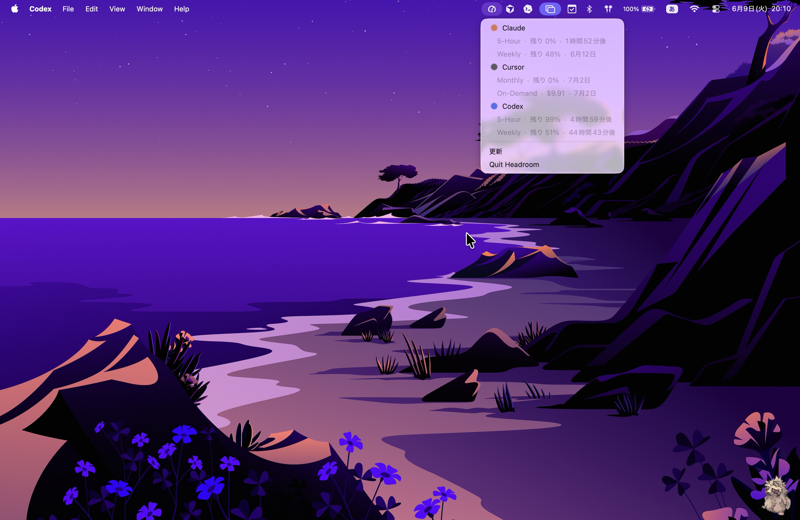

<!-- Language: [English](README.md) | 日本語 -->

# Headroom

AI コーディングツールの**利用枠の残量を一目で**把握する macOS の**メニューバー常駐アプリ**です。アイコンをクリックすると、各ツールの利用枠をどれだけ消費したか・いつリセットされるかが、macOS ネイティブのメニュー（NSMenu）で表示されます。

> Headroom = 残された余裕。壁にぶつかる前に残量を確認できます。

<p align="center">
  
</p>

## 対応ツール

| ツール | 表示内容 | 取得元（読み取り専用） |
|------|---------|------------------------|
| **Claude** | 5時間 / 週次 | macOS Keychain `Claude Code-credentials` → `api.anthropic.com/api/oauth/usage` |
| **Cursor** | 月次（含まれる枠）＋ On-Demand 超過 | `state.vscdb`（`cursorAuth/accessToken`）→ `api2.cursor.sh` |
| **Codex** | 5時間 / 週次 | `~/.codex/auth.json` → `chatgpt.com/backend-api/codex/usage` |

各ツールはサインインしている場合のみ表示され、未サインインなら「未接続」と控えめに案内します。取得は起動時・5分間隔・メニューの「更新」で行います。

## プライバシーとセキュリティ

- **読み取り専用。** トークンのリフレッシュや資格情報ストアへの書き込みは一切行いません。
- **ローカル完結。** 認証情報は端末外に出さず、各ツール自身の API に直接アクセスします。テレメトリ・サーバーはありません。

## インストール

### Homebrew（推奨）

```sh
brew install --cask --no-quarantine GentaAmeku/tap/headroom
```

このアプリはコード署名していない（無料・オープンソースのユーティリティ）ため、`--no-quarantine` を付けると Gatekeeper の警告なしで起動できます。

### 手動

1. [Releases](https://github.com/GentaAmeku/headroom/releases) から `Headroom_<version>_universal.dmg` をダウンロード。
2. **Headroom.app** を Applications にドラッグ。
3. 初回起動はアプリを右クリック →「**開く**」（1回だけ）、または:
   ```sh
   xattr -dr com.apple.quarantine /Applications/Headroom.app
   ```

Headroom は**ログイン項目**として自身を登録し、自動で起動します。解除は システム設定 →「一般」→「ログイン項目」から。

## 設定

Cursor の「含まれる」月予算はプランによって異なります。Headroom は既定で **$20/月** とし、それを超えた分は別行の **On-Demand** として表示します。予算は次のいずれかで上書きできます:

- 環境変数: `HEADROOM_CURSOR_BUDGET=50`
- または `~/.config/headroom/config.json`:
  ```json
  { "cursorMonthlyBudgetUsd": 50 }
  ```

## ソースからビルド

[Rust](https://rustup.rs) と [Node.js](https://nodejs.org) が必要です。

```sh
npm install
npm run tauri build -- --bundles dmg            # リリース .dmg
npm run tauri build -- --debug --bundles app    # デバッグビルド
```

成果物は `src-tauri/target/<profile>/bundle/macos/Headroom.app` に出力されます。

## 開発・内部仕様

プロジェクトの規約とアーキテクチャは [`AGENTS.md`](AGENTS.md)、用語は [`CONTEXT.md`](CONTEXT.md)、UI 指針は [`design.md`](design.md)、決定記録は [`docs/adr/`](docs/adr/) にあります。

## ライセンス

[MIT](LICENSE) © gameku
